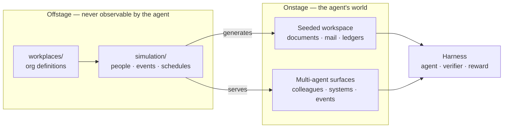

# Workbench

Workbench is a reinforcement-learning environment for realistic professional work. It gives an agent a believable workspace — the files, systems, colleagues, and interruptions of an actual job — so that evals, benchmarks, and post-training datasets measure competence rather than puzzle-solving.

Realism comes from a simulation that runs offstage. Workbench models an organization's people, calendars, and events, then uses that model two ways: to generate the artifacts an agent finds in its workspace, and to expose colleagues and systems as multi-agent surfaces the agent can interact with. The agent never sees the simulation itself.

## Why

Tasks assembled from synthetic prompts reward pattern completion. Real professional work is ambiguous, multi-turn, and full of context that lives in other people's heads: a controller who knows why last quarter's accrual looks wrong, a partner who changes the ask halfway through, an inbox that keeps filling while you work. Workbench reproduces those conditions faithfully enough that a reward signal means something, and cheaply enough to run thousands of trials.

## How it works

Three layers, with a hard boundary between what is simulated and what the agent can observe.



**Offstage — `workbench.simulation`, `workbench.workplaces`.** the simulation package is the domain-neutral engine — a clean-room, typed, async, deterministic rebuild of the Concordia generative agent-based modeling pattern: composed entities, a grounded game master that turns intents into typed world events, an interrupt-driven engine over simulated time, and a record/replay LM layer. Persona reasoning runs as DSPy programs (GEPA-optimizable). `workbench.workplaces` holds concrete definitions — a legal department today; an accounting firm next — expressed with the engine's primitives. See [`docs/simulation-engine.md`](docs/simulation-engine.md).

**Onstage — `workbench.core`, `workbench.tools`, `workbench.environment`.** The environment the agent inhabits: core contracts in `workbench.core`, the agent-facing tool systems (projections and MCP servers) in `workbench.tools`, workspace assembly in `workbench.environment`. Simulation output reaches the agent in exactly two forms — workspace data materialized before the run, and multi-agent modules served at runtime as tools. Neither exposes personas, hidden state, or ground truth.

**Harness — `datasets/`, `adapters/`.** [Harbor](https://www.harborframework.com/docs) is the native harness, agent runner, and verifier. Tasks live in `datasets/<dataset>/tasks/<task>/` in Harbor's task format and score with [Reward Kit](https://www.harborframework.com/docs/rewardkit). `adapters/` bridges the same environment to other frameworks such as Prime and Tinker.

## Repository layout

```
src/workbench/  one Python distribution, one import namespace
  core/           typed contracts: events, intents, actions, world log
  tools/          agent-facing tool systems: projections and MCP servers
  environment/    workspace materialization and bundle assembly
  simulation/     domain-neutral simulation engine
  workplaces/     concrete workplace definitions
  adapters/       eval harness: agents and models against workspaces
tests/          mirrors src/workbench/, plus tests/fixtures/ shared modules
environment/    container image: Dockerfile, setuid shim
datasets/       Harbor tasks, grouped into datasets
docs/           architecture and authoring guides
```

One distribution, managed by [uv](https://docs.astral.sh/uv/). The base install carries only the contracts and tool servers; the simulation engine's LM stack is the `simulation` extra (`uv sync` includes it for development; task containers install the base project only). Subpackage layering is enforced by `tests/test_layering.py`.

## Quickstart

```bash
uv sync                                   # install the Python workspace
uv run pytest                             # run the test suite
docker build -f workbench/environment/Dockerfile -t workbench:dev workbench/environment
```

Run a task against the image with Harbor:

```bash
harbor run -p datasets/<dataset>/tasks/<task> -a claude-code -m <model>
harbor view                               # inspect trajectory, verifier logs, reward
```

Tasks reference the prebuilt image through `[environment].docker_image` in `task.toml` rather than carrying their own Dockerfile, so a dataset run does not rebuild the environment per task.

## Toolchain

| Concern | Choice |
|---|---|
| Python | 3.14, managed with `uv`; run via `uv run` |
| Python types | Pydantic v2 models at every boundary |
| Python tests, lint | `pytest`, `ruff` |
| Prompt optimization | DSPy with GEPA, for persona and event fidelity |
| TypeScript | Bun, with pnpm where a package requires it |
| TypeScript types, lint | Zod at runtime boundaries, strict `tsc`, `oxlint` |
| Container | Ubuntu 26.04, Python 3.14, Node 24, `uv`, `bun`, `pnpm` |
| Verifier | Reward Kit, preinstalled in the image |
| Documents | [Paper Office](https://www.paperinstruments.com/paper-python) forks: `paper-docx`, `paper-pptx`, `paper-xlsx` |

## Domains

Initial coverage is finance, consulting, legal, and administrative work such as accounting and corporate operations. Domain knowledge belongs only in `workplaces/` and `datasets/`; the engine, the environment, and the adapters stay domain-neutral so a new vertical is a new workplace definition rather than a change to the framework.

## Documentation

Architecture notes, authoring guides, and conventions live in [`docs/`](docs/). Contributor and agent working rules are in [`AGENTS.md`](AGENTS.md).
